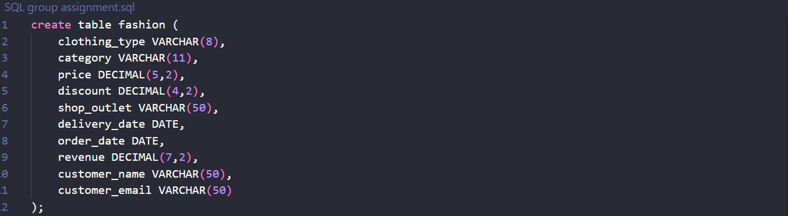
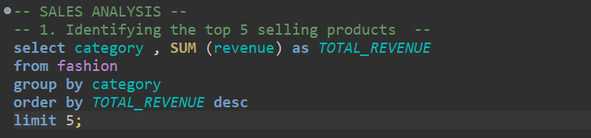
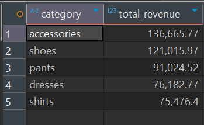
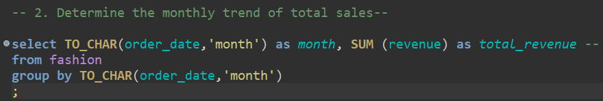
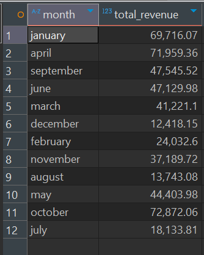
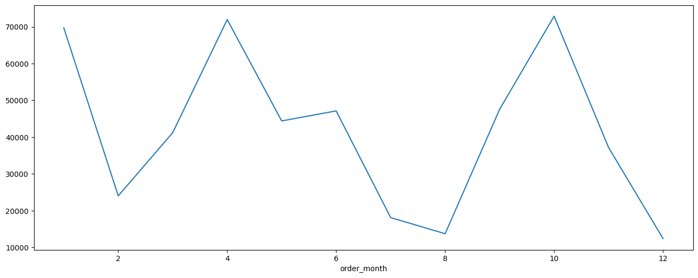

# 🛍️ Fashion Retail Sales — LUXDEVHQ Data Analytics Week 11 SQL Data Analysis Project

## 💡 Project Overview
This project focuses on applying SQL to explore, analyze, and extract meaningful business insights from a fashion database. The goal is to understand the data and develop data-driven recommendations for improving sales, customer understanding, and inventory management.

## 🎯 Learning Objectives
- We used SQL for data extraction, aggregation, and analysis and Python for basic visualization.

- We were to translate data into business insights.

- Present clear, actionable findings in both written reports and presentations.

## 🗂️ Dataset Information
The data comes from a transactional fashion database which contains 'clothing_type', 'category', 'price', 'discount', 'shop_outlet','delivery_date', 'order_date', 'revenue','customer_name','customer_email' as the columns

## Loading the Dataset
We created a postgresql aiven service and loaded our table in the dbeaver. Most of the analysis was done in dbeaver
1. Created a table Fashion to store our data

2. Inserted values into the created table

## Analysis Breakdown
### A. Sales Analysis
1. Top 5 selling products
- The objective was to identify the products with the highest revenue

After running the above query, we noted that the top 5 selling product categories were accessories, shoes, pants, dresses and finally shirts

2. Determine the monthly trend of total sales
- From our given order_date column, we extracted the month and grouped it with respective total revenue to check the revenue distribution over the months

- The output was as follows:

- We went ahead and did a line plot in python to view the trend

