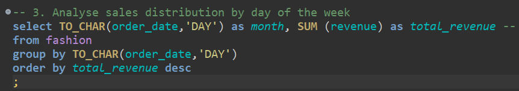
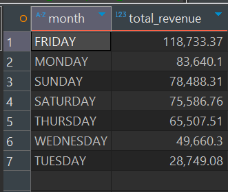
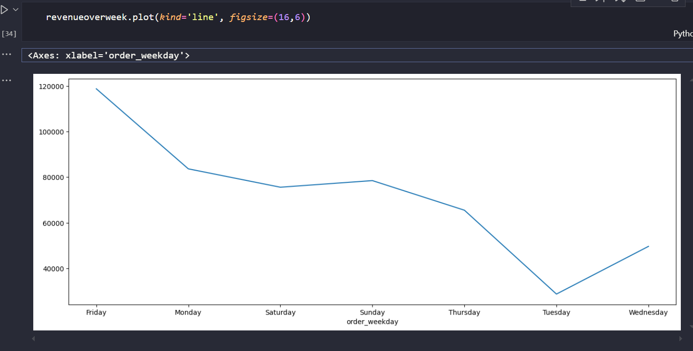
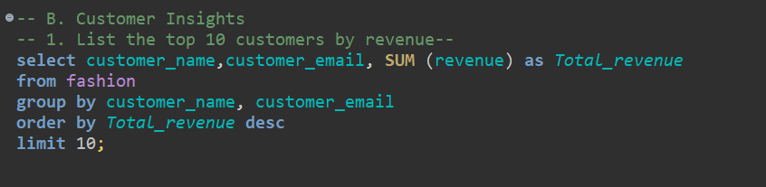
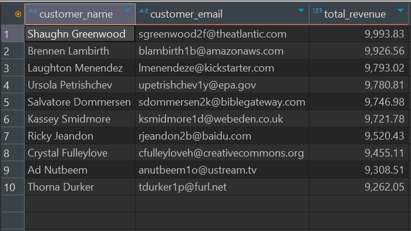
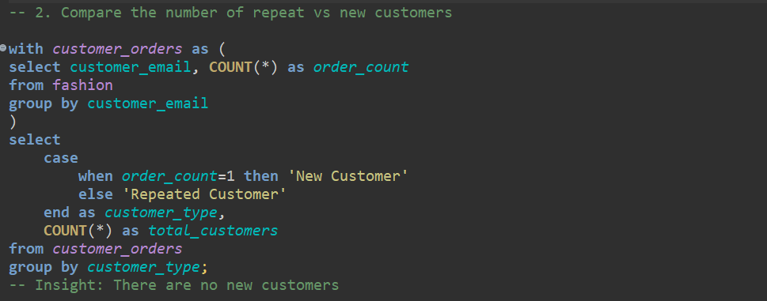
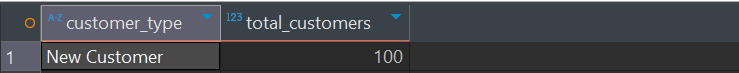

# 🛍️ Fashion Retail Sales — LUXDEVHQ Data Analytics Week 11 SQL Data Analysis Project

## 💡 Project Overview
This project focuses on applying SQL to explore, analyze, and extract meaningful business insights from a fashion database. The goal is to understand the data and develop data-driven recommendations for improving sales, customer understanding, and inventory management.

## 🎯 Learning Objectives
- We used SQL for data extraction, aggregation, and analysis and Python for basic visualization.

- We were to translate data into business insights.

- Present clear, actionable findings in both written reports and presentations.

## 🗂️ Dataset Information
The data comes from a transactional fashion database which contains 'clothing_type', 'category', 'price', 'discount', 'shop_outlet','delivery_date', 'order_date', 'revenue','customer_name','customer_email' as the columns

## Loading the Dataset
We created a postgresql aiven service and loaded our table in the dbeaver. Most of the analysis was done in dbeaver
1. Created a table Fashion to store our data

2. Inserted values into the created table

## Analysis Breakdown
### A. Sales Analysis
1. Top 5 selling products
- The objective was to identify the products with the highest revenue

After running the above query, we noted that the top 5 selling product categories were accessories, shoes, pants, dresses and finally shirts

2. Determine the monthly trend of total sales
- From our given order_date column, we extracted the month and grouped it with respective total revenue to check the revenue distribution over the months

- The output was as follows: October had the highest revenue(72872.06) and December having the lowest revenue (12418.15)

- We went ahead and did a line plot in python to view the trend

3. Analyze sales distribution by day of the week
- A step ahead in extracting the day of the week. We still used the TO_CHAR function to extract

- The output: Friday had the highest revenue (118733.37) and Tuesday generating the lowest revenue(28749.08)

- Using python, we created a line plot to display the revenue distribution over the days of the week

### B. Customer Insights
1. List the top 10 customers by Revenue
- We executed the below query to generate the customers column and respective total revenue. We went further to order them in descending order then limited the output to 10

- The output showed that 'Shaughn Greenwood' had generated the highest revenue(9993.83)

2. Compare the number of repead vs New customers
- Things getting deep here. We used ctes(common table expressions) to be able to group customers as either new or repeated

- The output showed that all customers were new.

